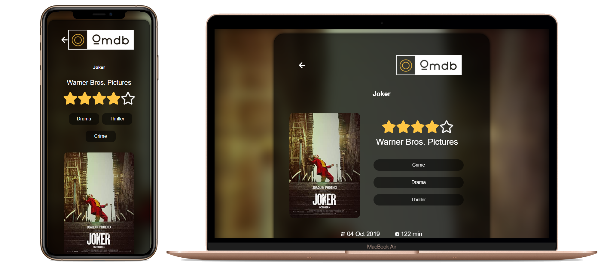

<h1 align="center">Omdb</h1>


<h3 align="center" justify="center">📽&nbsp;&nbsp;&nbsp;Encontre seus melhores e preferidos filmes .</h3>

<h6 align="center">Demo: http://omdb-pablo.netlify.app/</h6>

<p align="center">
  <a href="https://www.linkedin.com/in/pablobion/">
    
  </a>

  <a href="https://github.com/pablobion/omdb/commits/master">
    
  </a>
</p>

<p align="center">
  <a href="#-Sobre-o-projeto">Sobre o projeto</a>&nbsp;&nbsp;&nbsp;|&nbsp;&nbsp;&nbsp;
  <a href="#-Tecnologias">Tecnologias</a>&nbsp;&nbsp;&nbsp;|&nbsp;&nbsp;&nbsp;
  <a href="#-Como-começar">Como começar</a>&nbsp;&nbsp;&nbsp;
</p>




## 📽 Sobre o projeto

Projeto WEB de consulta de filmes, através da API pública http://imdbapi.org/

O projeto conta com informações relevantes sobre o filme pesquisado, desde nome, produtora, sinopse, duração, prêmios e notas dadas para o filme.
O mesmo conta com responsividade para dispositivos moveis, e conceitos de skeleton loading para diminuir a percepção de carregamento da api.


## 🚀 Tecnologias

Tecnologias que usei para desenvolver esse projeto

- [ReactJS](https://reactjs.org/)
- [React Router DOM](https://reacttraining.com/react-router/)
- [Styled Components](https://styled-components.com/)
- [Axios](https://github.com/axios/axios)
- [Polished](https://github.com/styled-components/polished)
- [Loading Skeleton](https://www.npmjs.com/package/react-loading-skeleton)
- [React icons](https://react-icons.github.io/react-icons/)


## 💻 Como começar 


**Clonando repositório e executando**

```bash
$ git clone https://github.com/pablobion/omdb && cd omdb
```

**Instalando as dependências**

```bash
$ yarn
```

**Iniciando**

```bash
$ yarn start
```


---

Feito por &nbsp; by Pablo Bion 👋 &nbsp;[Veja meu linkedin](www.linkedin.com/in/pablobion)
